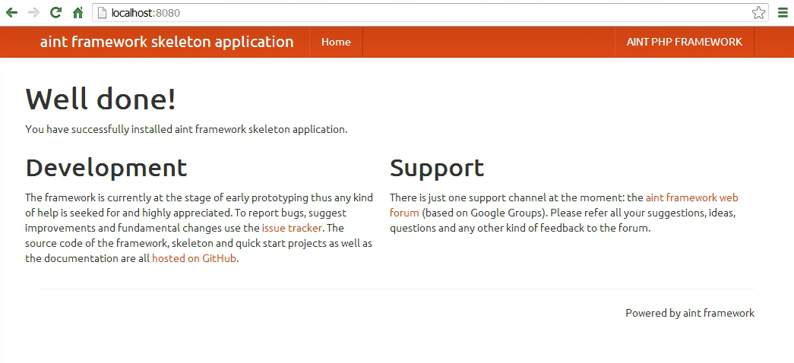

Skeleton Application
====================

To start development with **aint framework** we'll create a sample project from `the skeleton application git repository <https://github.com/aintframework/skeleton_application>`_.

You can either download and unzip it or, better, clone the repository::

    cd my/projects/dir
    git clone git://github.com/aintframework/skeleton_application.git albums_manager
    cd albums_manager

Install **aint framework** using composer::

    php composer.phar self-update
    php composer.phar install

Next, run the built-in web server::

    cd www
    php -S localhost:8080 dev-router.php

Your project is now running. Access `<http://localhost:8080>`_ in your browser:

